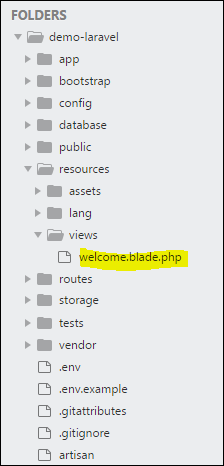

# Laravel - Blade Templates
Laravel 5.1 introduces the concept of using Blade, a templating engine to design a unique layout. The layout thus designed can be used by other views, and includes a consistent design and structure.

Blade is Laravel’s powerful and lightweight templating engine. It helps you write clean, reusable, and dynamic HTML by using easy syntax.

When compared to other templating engines, Blade is unique in the following ways −


### 2. Blade Syntax Basics
| Task          | Blade Syntax              |
| ------------- | ------------------------- |
| Echo variable | `{{ $name }}`             |
| If condition  | `@if`, `@elseif`, `@else` |
| Loops         | `@foreach`, `@for`        |
| Comment       | `{{-- comment --}}`       |


### 3. Blade Conditional Example
```bash
@if($age > 18)
    <p>Adult</p>
@else
    <p>Minor</p>
@endif

```

###  4. Blade Loops Example
```bash
@foreach($users as $user)
    <p>{{ $user->name }}</p>
@endforeach
```


### 5. Layouts and Sections
```bash
<!-- resources/views/layouts/app.blade.php -->
<html>
  <head>
    <title>My App</title>
  </head>
  <body>
    @yield('content')
  </body>
</html>
```

**Step 2: Page File with Content**
```bash
@extends('layouts.app')

@section('content')
  <h1>Welcome to Home Page</h1>
@endsection
```

### 6. Include Partial Files
```bash
@include('partials.header')
```


### 7. Passing Data to Blade
```bash
return view('home', ['name' => 'Ali']);
```
<p>Welcome, {{ $name }}</p>


| Feature         | Blade Syntax                  |
| --------------- | ----------------------------- |
| Echo data       | `{{ $value }}`                |
| If/else         | `@if`, `@else`, `@endif`      |
| Loops           | `@foreach`, `@for`, etc.      |
| Layout          | `@extends('layout')`          |
| Section/content | `@section`, `@yield`          |
| Include file    | `@include('file')`            |
| Comments        | `{{-- This is a comment --}}` |
